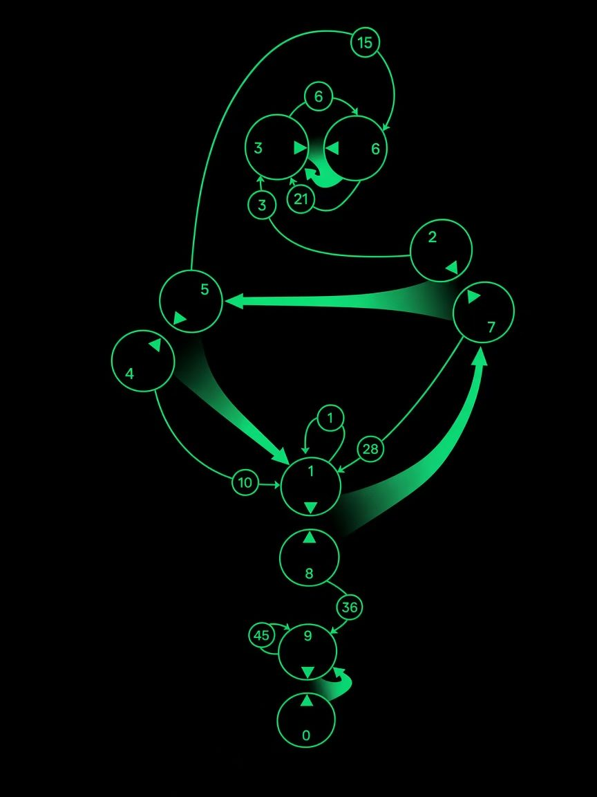

# CCRU Numogram Neural Network

A recurrent neural network architecture built upon **CCRU Numogram (The Decimal Labyrinth)**.

The primary entry point of this project is [`numogram.py`](numogram.py).

---

## 1. Numogram Topology



The Numogram consists of 10 nodes (Zones 0 through 9) distributed across three temporal zones:
* **The Warp (Zones 3, 6)**: Upper zone of numerical reflection and two-step transition.
* **The Torque (Zones 1, 2, 4, 5, 7, 8)**: Middle zone of chronological circulation and vortex currents.
* **The Plex (Zones 9, 0)**: Lower abyssal zone of Barker's spiral and gravitational core.

---

## 2. Topological Edges & PyTorch Neural Implementations

Every edge and structural channel in the Numogram corresponds directly to a PyTorch neural network layer or module:

### 1. Syzygies (5 Dual Pairs / 10 Mappings)
* **Topological Pairs**: Complementary twin pairs summing to 9: `9::0`, `8::1`, `7::2`, `6::3`, and `5::4`.
* **PyTorch Layer**: `self.syz_layers = nn.ModuleDict()` containing 10 linear transformations:
  ```python
  self.syz_layers[f"{u}_{v}"] = nn.Linear(d, d, bias=False)  # u -> v
  self.syz_layers[f"{v}_{u}"] = nn.Linear(d, d, bias=False)  # v -> u
  ```
* **Function**: Bidirectional cross-pair linear projection. Guarantees that even-numbered nodes (Zones 0, 2, 4, 8) maintain non-zero in-degrees, preventing signal starvation.

### 2. Currents (5 Flows to Tractors)
* **Topological Pathways**: Five syzygies feeding their energetic flows into gravitational attractors (Tractors):
  * `(5, 4) -> Zone 1` (Sink)
  * `(8, 1) -> Zone 7` (Surge)
  * `(7, 2) -> Zone 5` (Hold)
  * `(6, 3) -> Zone 3` (Warp attractor)
  * `(9, 0) -> Zone 9` (Plex spiral)
* **PyTorch Module**: `NumogramCurrent`
  ```python
  class NumogramCurrent(nn.Module):
      def __init__(self, d: int = 1):
          super().__init__()
          self.fc = nn.Linear(2 * d, d)

      def forward(self, x_u: torch.Tensor, x_v: torch.Tensor) -> torch.Tensor:
          cat = torch.cat([x_u, x_v], dim=-1)  # [x_u; x_v] in R^(2d)
          return self.fc(cat)                  # Projects to R^d
  ```
* **Function**: Concatenates states from both partners of a syzygy and projects them into the target tractor node.

### 3. Gates (9 Canonical Triangular Channels)
* **Topological Channels**: The 9 canonical triangular number gates:
  * `Gt-01`: $1 \to 1$ (Self-loop on Zone 1)
  * `Gt-03`: $2 \to 3$ (Torque to Warp)
  * `Gt-06`: $3 \to 6$ (Intra-Warp wormhole)
  * `Gt-10`: $4 \to 1$ (Pupana feed to Sink)
  * `Gt-15`: $5 \to 6$ (Torque to Warp)
  * `Gt-21`: $6 \to 3$ (Intra-Warp wormhole)
  * `Gt-28`: $7 \to 1$ (Surge to Sink spine)
  * `Gt-36`: $8 \to 9$ (Torque to Plex plunge)
  * `Gt-45`: $9 \to 9$ (Self-loop on Zone 9)
* **PyTorch Module**: `NumogramGate` (SwiGLU / MoE-style gated linear unit)
  ```python
  class NumogramGate(nn.Module):
      def __init__(self, d: int = 1, h: int = 4):
          super().__init__()
          self.fc_gate = nn.Linear(d, h)  # Score branch A
          self.fc_val = nn.Linear(d, h)   # Candidate branch B
          self.fc_out = nn.Linear(h, d)   # Output projection

      def forward(self, x: torch.Tensor) -> torch.Tensor:
          a = torch.sigmoid(self.fc_gate(x))
          b = self.fc_val(x)
          m = a * b                       # Element-wise gating
          return self.fc_out(m)
  ```
* **Function**: Implements non-linear gated channel transmission with learnable gating scores and candidate representations. Idea from Qwen LLM's SwiGLU. 

### 4. Node Update Layer (Global Integration)
* **PyTorch Layer**:
  ```python
  self.update_layer = nn.Linear(2 * d, d)
  ```
* **Function**: Each node concatenates its prior state $x_i^{(t)}$ and incoming aggregated flow $\text{in\_acc}_i^{(t)}$:
  $$x_i^{(t+1)} = \text{update\_layer}([x_i^{(t)}; \text{in\_acc}_i^{(t)}])$$
  Allows the network to autonomously learn linear transfer, residual accumulation, or leaky integration via gradient backpropagation.

---

## 3. Running & Diagnostics

### Requirements
* Python >= 3.9
* PyTorch >= 2.0

### Execution
Run the standalone model entry point:
```bash
python numogram.py
```

### Output Summary
Executing `numogram.py` performs a recurrence run for $T=100$ steps and outputs two diagnostic tables:

1. **Backward BPTT Gradient Flow**:
   * Evaluates $\rho(J)$ (the spectral radius of the single-step Jacobian) at each time step.
   * Tracks total gradient Frobenius norm backpropagated through time from $t=T$ to $t=0$.
   * Identifies the Top 3 gradient-contributing zones at each step.
2. **Forward State Evolution**:
   * Tracks total state norm $\|x^{(t)}\|_2$ forward across time.
   * Dynamically ranks and displays the Top 3 active zones by absolute magnitude.

---

## 4. Special Notes

* **Official Entry Point**: [`numogram.py`](numogram.py) is the **sole maintained and active entry point** for this codebase.
* **Legacy & Prototype Code**: All other scripts and assets in this repository (including `explore.py`, `hopfield_numogram.py`, `run_hopfield.py`, `server.py`, and the `web/` frontend directory) are legacy experimental prototypes and scratch testing code from earlier iterations that are no longer actively maintained.
